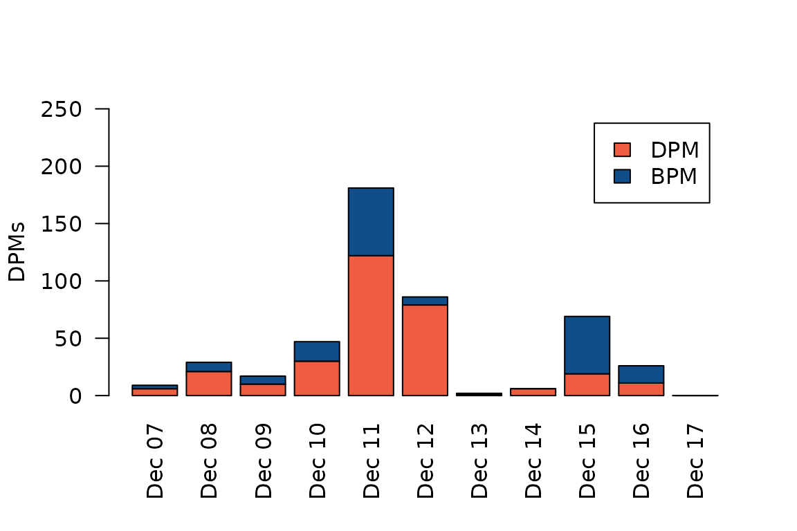

# Overview and basic usage

## fpod

FPOD is an R package that enables directly loading FPOD and CPOD data
files into R

## Features

The most important feature in this package is the capability of reading
FPOD and CPOD data into R directly from the FPOD data files (i.e. the
.CP1, .CP3, .FP1 and .FP3 files). The FPOD data files contain binary
data, so they can’t trivially be read into R using the usual approach
(e.g. fread or read.csv). This package decodes the binary data and
imports all the data in one go (i.e. header/metadata, clicks, KERNO
classifications, environmental data and pseudo-WAV data). It is then
trivial to aggregate data as you please, e.g. DPMs per time block. The
advantage of handling data processing in R is a long topic, but suffice
it to say that it 1) simplifies things (many fewer steps, as different
vars have to be exported in multiple goes in the official FPOD app), and
more importantly, 2) makes data processing 100% transparent and
reproducible.

Note that at the time of writing, the fpod R package has only partial
support for CPOD files - that is to say, it can only import click and
classification data, but not environmental & wav data. I plan to add
this in the future.

## Suggested workflow

1.  Use the official FPOD app to import FPOD data from a FPOD memory
    card (this generates a FP1 file)
2.  Use the FPOD app to run the KERNO or KERNO-F classifier (this
    generates a CP3 or FP3 file)
3.  Perform checks, edits and validations (again, in the FPOD app)
4.  Use the FPOD R package (this package) to read the FP3 file data into
    R
5.  Run your data processing and analyses in R

## Basic usage

Some basic examples are provided below. See ?fp_read for details.

First, let’s load the package and read a FP3 file. For this example,
we’ll use the sample data bundled with the package, which contains 10
days of FPOD data from a quiet site in northern Troms county, in Norway.

``` r
library(fpod)
fn <- fp_example("gullars_period1.FP3")
dat <- fp_read(fn)
```

This gives us a list with four elements, each of which is a data.table
(however, the WAV element may be missing depending on the specific file
being read).

``` r
names(dat)
#> [1] "header" "env"    "wav"    "clicks"
```

Let’s inspect each of these elements in turn.

``` r
str(dat$header)
#> List of 15
#>  $ pod_id          : int 7660
#>  $ first_logged_min: int 65709000
#>  $ last_logged_min : int 65723400
#>  $ water_depth     : int 30
#>  $ deployment_depth: int 0
#>  $ lat_text        : chr "70,03332"
#>  $ lon_text        : chr "18,9162"
#>  $ location_text   : chr ""
#>  $ notes_text      : chr ""
#>  $ gmt_text        : chr ""
#>  $ pic_ver         : raw 23
#>  $ fpga_ver        : int 1034
#>  $ extended_amps   : logi TRUE
#>  $ clicks_in_fp1   : num 48680158
#>  $ filename        : chr "/home/runner/work/_temp/Library/fpod/extdata/gullars_period1.FP3"
```

We can see that this gives us a mix of technical and deployment specific
metadata. In fact, there’s a lot more information stored in the
CPOD/FPOD headers that the fpod package currently doesn’t care about.
Also, the specific information available may vary between CPOD and FPOD
files. Note that the time-specification stored in `first_logged_min` and
`last_logged_min` both refer to the minutes elapsed since 1900-01-01. We
can easily convert this to a more human-friendly date format:

``` r
as.POSIXct("1900-01-01", tz="") + dat$header$first_logged_min * 60
#> [1] "2024-12-07 06:00:00 UTC"
```

We multiply by 60 since R interprets the number as seconds in POSIXct
arithmetic.

Next we have a data.table called `env`. This table lists the angle from
vertical (in degrees) of the pod, the temperature recorded by the pod,
as well as battery voltage (in desivolts) for each of the two battery
columns, per minute. The minutes are relative to when the pod was
started, i.e. `first_logged_min`.

``` r
str(dat$env)
#> Classes 'data.table' and 'data.frame':   14400 obs. of  7 variables:
#>  $ minute : int  1 2 3 4 5 6 7 8 9 10 ...
#>  $ angle  : int  36 36 28 36 35 26 32 32 34 32 ...
#>  $ degC   : int  6 6 6 6 6 6 6 6 6 6 ...
#>  $ bat1v  : int  79 79 79 79 79 79 79 79 80 79 ...
#>  $ bat2v  : int  70 69 69 70 70 70 69 69 69 69 ...
#>  $ bat_use: int  1 1 1 1 1 1 1 1 1 1 ...
#>  $ pod_on : logi  TRUE TRUE TRUE TRUE TRUE TRUE ...
#>  - attr(*, ".internal.selfref")=<externalptr>
```

To understand the battery levels better, we can calculate the average
voltage (in units of volts) per battery, which is probably what we’d use
if we wanted to plot battery usage over time.

``` r
head(dat$env$bat1v/10/5)
#> [1] 1.58 1.58 1.58 1.58 1.58 1.58
```

Now let’s turn our attention to the next element: The wav data.table
holds extra information (inter-peak-intervals, IPI + sound pressure
level, SPL) for a sample of recorded clicks, usually less than 1%, but
possibly more or less depending on user configuration.

``` r
str(dat$wav)
#> Classes 'data.table' and 'data.frame':   14053 obs. of  3 variables:
#>  $ click_no: int  548 548 548 548 548 548 548 737 737 737 ...
#>  $ IPI     : int  255 29 29 30 30 31 34 255 255 255 ...
#>  $ SPL     : int  8 37 45 46 40 27 24 3 12 4 ...
#>  - attr(*, ".internal.selfref")=<externalptr>
```

Finally, and most importantly, we have the clicks data:

``` r
str(dat$clicks)
#> Classes 'data.table' and 'data.frame':   82637 obs. of  14 variables:
#>  $ pod          : int  7660 7660 7660 7660 7660 7660 7660 7660 7660 7660 ...
#>  $ time         : POSIXct, format: "2024-12-07 12:42:11" "2024-12-07 12:42:11" ...
#>  $ minute       : int  402 402 402 402 402 402 402 402 402 402 ...
#>  $ microsec     : int  11382235 11467200 11552250 11637180 11722190 11892225 11977090 12062095 12147010 12231990 ...
#>  $ click_no     : int  1 2 3 4 5 6 7 8 9 10 ...
#>  $ train_id     : int  1 1 1 1 1 1 1 1 1 1 ...
#>  $ species      : chr  "Unclassed" "Unclassed" "Unclassed" "Unclassed" ...
#>  $ quality_level: int  1 1 1 1 1 1 1 1 1 1 ...
#>  $ echo         : logi  FALSE FALSE FALSE FALSE FALSE FALSE ...
#>  $ ncyc         : int  4 6 6 12 5 3 3 3 4 10 ...
#>  $ pkat         : int  0 4 3 7 3 0 2 2 0 3 ...
#>  $ khz          : num  98 114 133 103 111 114 103 100 108 103 ...
#>  $ amp_at_max   : int  30 43 25 44 30 22 26 24 34 37 ...
#>  $ has_wav      : logi  FALSE FALSE FALSE FALSE FALSE FALSE ...
#>  - attr(*, ".internal.selfref")=<externalptr> 
#>  - attr(*, "start")= POSIXct[1:1], format: "2024-12-07 06:00:00"
#>  - attr(*, "on")= int [1:14400] 1 2 3 4 5 6 7 8 9 10 ...
```

And that’s pretty much it. Now you have your CPOD/FPOD data in R and can
do whatever you want with it. Most of the columns listed above should be
fairly self-explanatory if you’re used to working with FPOD data. If
not, or if you just need a reminder, you can always see ?fp_read for a
detailed overview. Note that if you’re reading a CP1 or FP1 file, then
the species column will be all NAs, since there is no information from
the KERNO classifier in those files.

## Common tasks

The fpod package does provide a couple of convenience functions to
facilitate common tasks. We’ll have a look at those here.

First, we can use
[`fp_summarize()`](https://supermoan.github.io/fpod/reference/fp_summarize.md)
to sum up detection-positive-minutes (DPMs) for a set of clicks. A DPM
is defined as 1 if we have at least one detection during that minute; 0
otherwise. Usually, we will want to first subset only the clicks we care
about for our analysis. For example, let’s calculate DPMs for NBHF
(narrow-band, high frequency) clicks of quality 2 or better. For the
region where these data were collected, this corresponds to selecting
only harbour porpoise clicks.

``` r
nbhf <- dat$clicks[species == "NBHF" & quality_level >= 2]
dpm <- fp_summarize(nbhf)
print(dpm)
#>          pod                time   dpm   bpm
#>        <int>              <POSc> <int> <int>
#>     1:  7660 2024-12-07 06:01:00     0     0
#>     2:  7660 2024-12-07 06:02:00     0     0
#>     3:  7660 2024-12-07 06:03:00     0     0
#>     4:  7660 2024-12-07 06:04:00     0     0
#>     5:  7660 2024-12-07 06:05:00     0     0
#>    ---                                      
#> 14396:  7660 2024-12-17 05:56:00     0     0
#> 14397:  7660 2024-12-17 05:57:00     0     0
#> 14398:  7660 2024-12-17 05:58:00     0     0
#> 14399:  7660 2024-12-17 05:59:00     0     0
#> 14400:  7660 2024-12-17 06:00:00     0     0
```

Of course, there were no detections in the first and last 5 minutes of
the pod’s recording, so all we see are zeros in this preview. But we can
expect some rows to be nonzero.

Let’s just verify to be sure.

``` r
sum(dpm$dpm)
#> [1] 472
```

There you go!

You may also have noticed there’s another column `bpm` in the data.table
returned by
[`fp_summarize()`](https://supermoan.github.io/fpod/reference/fp_summarize.md).
This brings us to the other convenience function in `fpod`,
[`fp_find_buzzes()`](https://supermoan.github.io/fpod/reference/fp_find_buzzes.md).
This function tries to do exactly what the name implies - find NBHF
buzzes, which are commonly taken to be indicative of feeding. See
?fp_find_buzzes for some information on exactly how this is achieved.

Similar to
[`fp_summarize()`](https://supermoan.github.io/fpod/reference/fp_summarize.md),
[`fp_find_buzzes()`](https://supermoan.github.io/fpod/reference/fp_find_buzzes.md)
should be passed the subset of clicks for which we want to find buzzes.
While it only makes sense to use this on NBHF clicks, the function
doesn’t care about that, it will try to find buzzes for whatever clicks
data you give it.

``` r
buzz <- fp_find_buzzes(nbhf)
str(buzz)
#>  int [1:43216] 0 0 0 0 0 0 0 0 0 0 ...
table(buzz)
#> buzz
#>     0     1 
#> 34321  8895
```

We can see that the function gives us a vector of 1s and 0s. You’ll find
that the length of this vector is identical to the number of rows in the
clicks data.table that we used.

``` r
nrow(nbhf)
#> [1] 43216
length(buzz)
#> [1] 43216
```

So we now have a classification for each NBHF click that tells us that
it was or wasn’t a feeding buzz, with value 1 and 0, respectively.

We can add the buzz info to the NBHF clicks data.table we’re
investigating.

``` r
nbhf$buzz <- buzz
```

If we now re-execute
[`fp_summarize()`](https://supermoan.github.io/fpod/reference/fp_summarize.md)
on the updated data.table, we’ll find that it can see and understand the
buzz column, and it will handle buzzes in a similar way as it handles
detections; by summing them up per minute.

``` r
dpm2 <- fp_summarize(nbhf)
sum(dpm2$dpm)
#> [1] 472
sum(dpm2$bpm)
#> [1] 167
```

Now that we have NBHF detections and buzzes in minute-resolution, we can
use that as a basis to further aggregate data to some time scale that we
think is sensible for our purposes, whether it be plotting trends or
statistical analysis. In this case, let’s sum up DPMs and BPMs per day.

``` r
dpm_per_day <- dpm2[, .(dpm = sum(dpm), bpm = sum(bpm)), .(date = as.Date(time))]
```

Let’s illustrate these data with a simple stacked barplot. Note that we
subtract BPM from DPMs to avoid double-counting detections, since a BPM
implies a DPM (a porpoise must obviously have been detected for there to
be porpoise clicks to classify as buzzes).

``` r
    mat <- matrix(c(dpm_per_day$dpm - dpm_per_day$bpm, dpm_per_day$bpm), nrow=2, byrow=TRUE)
    barplot(mat, las = 2, ylim=c(0,250), col = c("tomato2", "dodgerblue4"),
            names.arg = format(dpm_per_day$date, "%b %d"), xlab="", ylab = "DPMs")
    legend("topright", inset = 0.05, fill = c("tomato2", "dodgerblue4"),
           legend = c("DPM", "BPM"))
```

 We see that we have
the most NBHF detections on December 11, when we have almost 200 DPMs.
This corresponds to 200/1440 = 14%, i.e. porpoises were detected at this
site for 14% of the day that day. The highest proportion of feeding
buzzes occurred four days later, on December 15, when more than half of
all clicks have been classified as feeding buzzes.

Ok, so that’s an overview of the three functions that are currently
available in the fpod package. The package really is primarily meant to
get the CP3/FP3 data into R in a streamlined manner, and to help
facilitate transparency and reproducible code. But the formal analysis
is left to the user! Have a look at
[`?fp_read`](https://supermoan.github.io/fpod/reference/fp_read.md),
[`?fp_find_buzzes`](https://supermoan.github.io/fpod/reference/fp_find_buzzes.md)
and `fp_summarize` for more details on each of these functions.

## Disclaimer

Note that this package is not affiliated with the manufacturer of the
CPOD and FPOD [Chelonia](https://chelonia.co.uk/).
